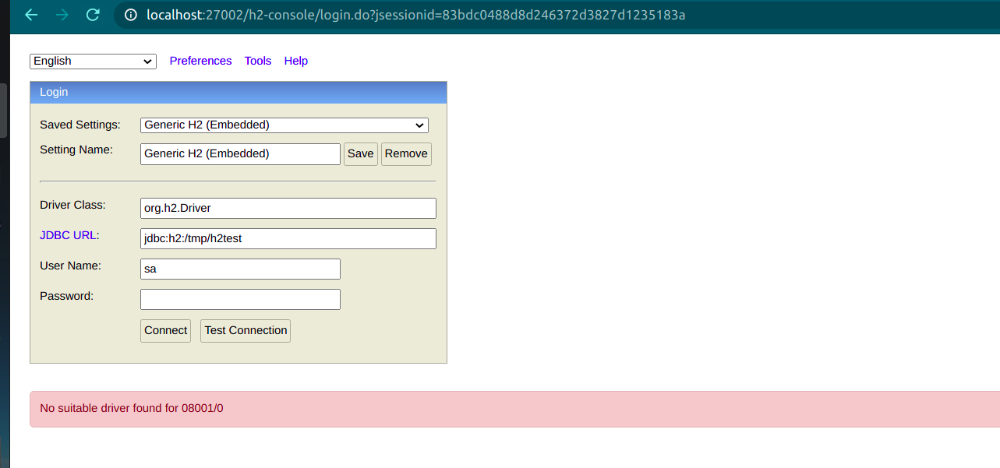
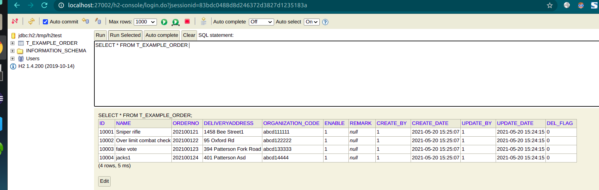

# XCloud Component Integration Feign Examples

> This example demonstrates how to use `xcloud-component-rpc` to quickly integrate feign based distributed architecture based on external integration locally.

### Quick start
- 1. [Start the Eureka service locally first](../xcloud-component-integration-springcloud-eureka-server/README.md)

- 2. Start [RpcExampleService](xcloud-component-integration-example-starter-service/src/main/java/com/wl4g/RpcExampleService.java) and [RpcExampleWeb](xcloud-component-integration-example-starter-web/src/main/java/com/wl4g/RpcExampleWeb.java)

- 3. Browser access testing:  

Request:
`http://localhost:27001/feign-example-web/order/list?pageSize=2&pageNo=1`

Response:
```
{"code":200,"status":"Normal","requestId":null,"message":"Ok","data":[{"orderNo":10001,"name":"Sniper rifle","deliveryAddress":"1458 Bee Street1","attributes":null},{"orderNo":10002,"name":"Over limit combat check","deliveryAddress":"95 Oxford Rd","attributes":null},{"orderNo":10003,"name":"fake vote","deliveryAddress":"394 Patterson Fork Road","attributes":null}]}
```

`http://localhost:27001/feign-example-web/order/createOrder`

Request:

```
{
  "orderNo": 2021123124,
  "name": "jack121",
  "deliveryAddress":"china xxx 01",
  "remark": "aaabbccc12121"
}
```

Response:

```
```


### FAQ
- 1. How to view the data of H2 database?


